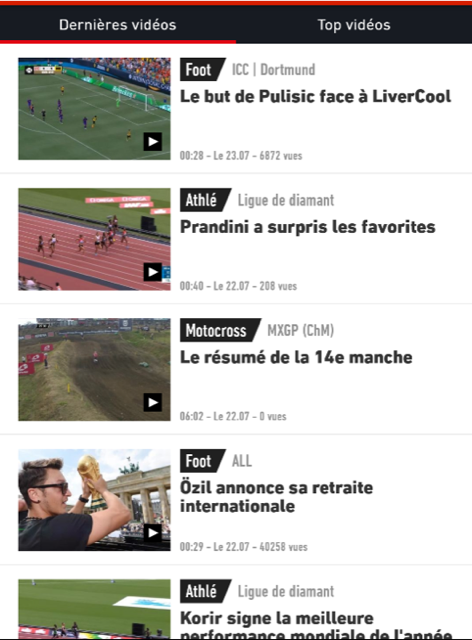

**Test L'Équipe**

You need to display two sport flows on two pages/tabs: **Dernières vidéos** and **Top videos** by accessing to them via HTTP API <https://raw.githubusercontent.com/pedrocactus/Lequipetest/master/video-flux.json?token=ABABZS42BCSP5ZNY3YBKNWS5N62TG>

Each flow item must contain:

* title (onglets -> flux -> items -> titre)
* sport type (onglets -> flux -> items -> sport -> nom)
* icon (onglets -> flux -> items -> objet -> image -> url)

You must specify **width** and **hight** for the url to be able to download an image. For instance, the following url: <https://medias.lequipe.fr/img-video-cover/1500000000988715/{width}/{height}> must be formatted like this: <https://medias.lequipe.fr/img-video-cover/1500000000988715/320/280> to download an icon with 320x240 resolution.

Good luck!
